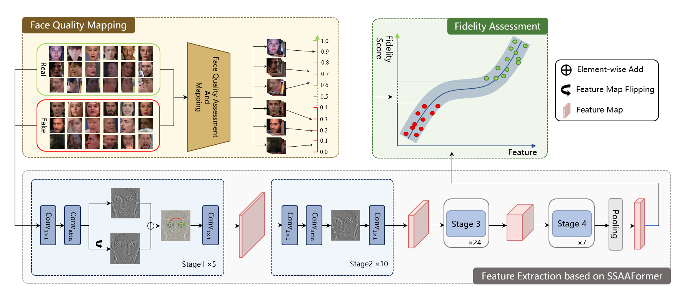

# DeepFidelity: Perceptual Forgery Fidelity Assessment for Deepfake Detection

This repository is the official implementation of [DeepFidelity: Perceptual Forgery Fidelity Assessment for Deepfake Detection](). 

## Introduction

DeepFidelity is a novel Deepfake detection framework that adaptively distinguishes real and fake faces with varying image quality by mining the perceptual forgery fidelity of face images. Specifically, we improve the model's ability to identify complex samples by mapping real and fake face data of different qualities to different scores to distinguish them in a more detailed way. In addition, we propose a network structure called Symmetric Spatial Attention Augmentation based vision Transformer (SSAAFormer), which uses the symmetry of face images to promote the network to model the geographic long-distance relationship at the shallow level and augment local features. 



## Requirements

```
torch==1.12.1+cu113
torchvision==0.15.2
timm==0.4.12
```

After configuring the environment, verify that your installation is working by executing `demo.py`.

```
python /code/SSAAFormer/token_labeling/demo.py
```

## Face Quality Mapping

We use the previously published approach for face quality assessment. The code can be obtained from here: https://github.com/pterhoer/FaceImageQuality

After obtaining the face quality score, you can perform quality score mapping by executing `faceQualityMapping/quality_mapping.py`.

## Training

To train the backbone network, run:

```
bash /code/SSAAFormer/token_labeling/exp/uniformer_large_ls_tl_224/run.sh
```

To train an SVR to map features to fidelity score, run:

```
python /code/SSAAFormer/token_labeling/fidelity_train.py
```

## Evaluation

To evaluate our model, run:

```
bash /code/SSAAFormer/token_labeling/fidelity_test.py
```

## Results

Our model achieves the following performance on [FaceForensics++](https://github.com/ondyari/FaceForensics), [Celeb-DF (v2)](https://github.com/yuezunli/celeb-deepfakeforensics),  and [WildDeepfake]([GitHub - deepfakeinthewild/deepfake-in-the-wild: deepfake dataset collected on the web for deepfake detection](https://github.com/deepfakeinthewild/deepfake-in-the-wild)):

| Dataset       | Acc    | AUC    | Model                                                                                                  |
|:-------------:|:------:|:------:|:------------------------------------------------------------------------------------------------------:|
| FF++ c23      | 98.89% | 99.67% | [FF++ c23](https://drive.google.com/file/d/1Z9V_pwXL5uBGkO8YBplTmSagHCaFStRo/view?usp=drive_link)      |
| Celeb-DF (v2) | 100%   | 100%   | [Celeb-DF (v2)](https://drive.google.com/file/d/11NxTLIk-V1f9bA-PPx91KS1GpC7qF7r_/view?usp=drive_link) |
| WildDeepfake  | 88.34% | 92.33% | [WildDeepfake](https://drive.google.com/file/d/1ZkyWBeM9pzwcm_-u5j99cpgrS2zku7Su/view?usp=drive_link)  |

Our code is modified based on https://github.com/Sense-X/UniFormer, here for the explanation and thanks.